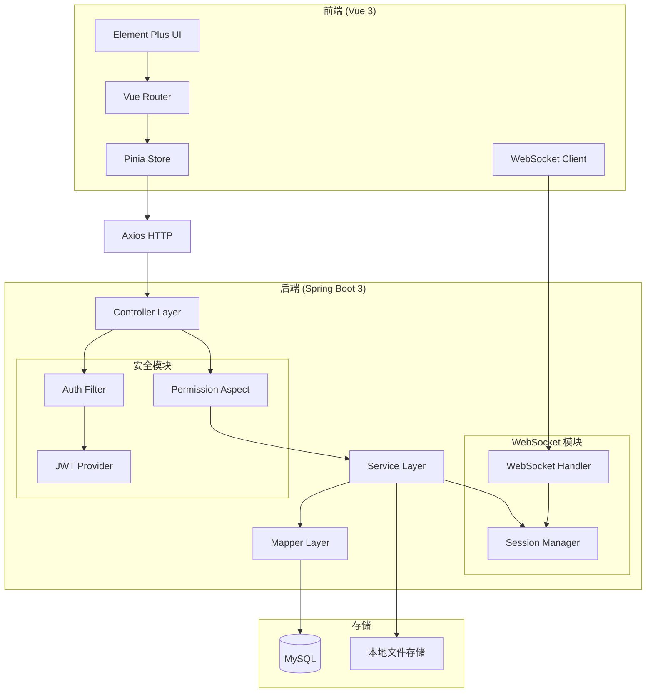
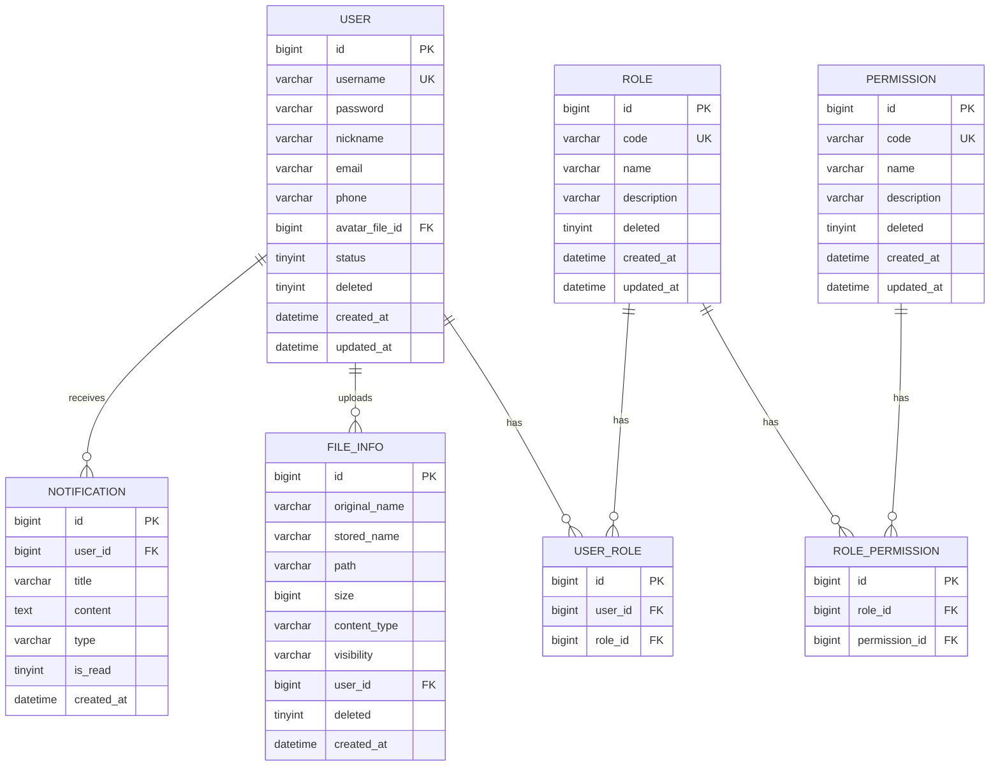

# 设计文档

## 概述

本设计文档描述管理系统基座的技术架构和实现方案。系统采用前后端分离架构，后端使用 Spring Boot 3.2.x + MyBatis-Plus，前端使用 Vue 3 + Element Plus。

### 技术栈

**后端：**
- Spring Boot 3.2.x
- MyBatis-Plus 3.5.x
- MySQL 8.0
- JWT (jjwt 0.12.x)
- Lombok
- Spring WebSocket
- SpringDoc OpenAPI 2.x

**前端：**
- Vue 3.4.x (Composition API + `<script setup>`)
- Vite 5.x
- Pinia 2.x
- Vue Router 4.x
- Element Plus 2.x
- Axios

**后端约定：**
- 使用 Lombok 简化样板代码（例如实体/DTO 的 `@Data` 等），并确保 IDE 启用 Annotation Processing。
- Maven 依赖示例（版本由 Spring Boot 依赖管理统一控制）：

```xml
<dependency>
  <groupId>org.projectlombok</groupId>
  <artifactId>lombok</artifactId>
  <scope>provided</scope>
</dependency>
```

## 架构

### 项目结构

```
admin-base/
├── backend/                          # 后端项目
│   ├── src/main/java/com/example/admin/
│   │   ├── AdminApplication.java     # 启动类
│   │   ├── config/                   # 配置类
│   │   │   ├── SecurityConfig.java
│   │   │   ├── WebSocketConfig.java
│   │   │   ├── MyBatisPlusConfig.java
│   │   │   └── OpenApiConfig.java
│   │   ├── controller/               # 控制器层
│   │   │   ├── AuthController.java
│   │   │   ├── UserController.java
│   │   │   ├── RoleController.java
│   │   │   ├── PermissionController.java
│   │   │   ├── FileController.java
│   │   │   └── NotificationController.java
│   │   ├── service/                  # 服务层
│   │   │   ├── AuthService.java
│   │   │   ├── UserService.java
│   │   │   ├── RoleService.java
│   │   │   ├── PermissionService.java
│   │   │   ├── FileService.java
│   │   │   └── NotificationService.java
│   │   ├── mapper/                   # 数据访问层
│   │   │   ├── UserMapper.java
│   │   │   ├── RoleMapper.java
│   │   │   ├── PermissionMapper.java
│   │   │   ├── UserRoleMapper.java
│   │   │   ├── RolePermissionMapper.java
│   │   │   ├── FileMapper.java
│   │   │   └── NotificationMapper.java
│   │   ├── entity/                   # 实体类
│   │   │   ├── User.java
│   │   │   ├── Role.java
│   │   │   ├── Permission.java
│   │   │   ├── UserRole.java
│   │   │   ├── RolePermission.java
│   │   │   ├── FileInfo.java
│   │   │   └── Notification.java
│   │   ├── security/                 # 安全相关
│   │   │   ├── JwtTokenProvider.java
│   │   │   ├── JwtAuthenticationFilter.java
│   │   │   ├── RequiresPermission.java
│   │   │   ├── PermissionAspect.java
│   │   │   └── SecurityContext.java
│   │   ├── websocket/                # WebSocket
│   │   │   ├── WebSocketHandler.java
│   │   │   └── WebSocketSessionManager.java
│   │   ├── exception/                # 异常处理
│   │   │   ├── BusinessException.java
│   │   │   └── GlobalExceptionHandler.java
│   │   └── common/                   # 公共类
│   │       ├── Result.java
│   │       └── PageResult.java
│   └── src/main/resources/
│       ├── application.yml
│       └── mapper/                   # MyBatis XML
│
└── frontend/                         # 前端项目
    ├── src/
    │   ├── api/                      # API 接口
    │   │   ├── auth.ts
    │   │   ├── user.ts
    │   │   ├── role.ts
    │   │   ├── permission.ts
    │   │   ├── file.ts
    │   │   └── notification.ts
    │   ├── components/               # 公共组件
    │   ├── composables/              # 组合式函数
    │   │   └── useWebSocket.ts
    │   ├── directives/               # 自定义指令
    │   │   └── permission.ts
    │   ├── layouts/                  # 布局组件
    │   │   └── AdminLayout.vue
    │   ├── router/                   # 路由配置
    │   │   └── index.ts
    │   ├── stores/                   # Pinia 状态
    │   │   ├── user.ts
    │   │   └── notification.ts
    │   ├── utils/                    # 工具函数
    │   │   ├── request.ts
    │   │   └── storage.ts
    │   ├── views/                    # 页面组件
    │   │   ├── login/
    │   │   ├── user/
    │   │   ├── role/
    │   │   ├── permission/
    │   │   ├── file/
    │   │   └── notification/
    │   ├── App.vue
    │   └── main.ts
    ├── index.html
    ├── vite.config.ts
    └── package.json
```

### 系统架构图



## 组件与接口

### 后端组件

#### 1. JwtTokenProvider - JWT 令牌提供者

```java
public class JwtTokenProvider {
    // 生成 Access Token（1天有效期）
    public String generateAccessToken(User user, List<String> roles);
    
    // 生成 Refresh Token（30天有效期）
    public String generateRefreshToken(User user);
    
    // 验证并解析 Token
    public Claims parseToken(String token);
    
    // 检查 Token 是否过期
    public boolean isTokenExpired(String token);
    
    // 从 Token 获取用户ID
    public Long getUserIdFromToken(String token);
}
```

说明：
- Access_Token 与 Refresh_Token 均为 JWT；使用 claim `token_type` 区分（`access` / `refresh`）。
- JwtAuthenticationFilter 仅接受 `token_type=access` 的 Token（来自 `Authorization: Bearer ...`）。
- `/api/auth/refresh` 仅接受 `token_type=refresh` 的 Token（来自请求体 `refreshToken`），刷新后旧 Refresh_Token 不撤销（不维护撤销列表）。

#### 2. JwtAuthenticationFilter - JWT 认证过滤器

```java
public class JwtAuthenticationFilter extends OncePerRequestFilter {
    // 从请求头提取 Token
    private String extractToken(HttpServletRequest request);
    
    // 验证 Token 并设置安全上下文
    protected void doFilterInternal(HttpServletRequest request, 
                                    HttpServletResponse response, 
                                    FilterChain chain);
}
```

#### 3. RequiresPermission - 权限注解

```java
@Target({ElementType.METHOD, ElementType.TYPE})
@Retention(RetentionPolicy.RUNTIME)
public @interface RequiresPermission {
    String value();  // 权限标识，如 "user:create"
}
```

#### 4. PermissionAspect - 权限切面

```java
@Aspect
@Component
public class PermissionAspect {
    // 拦截 @RequiresPermission 注解的方法
    @Around("@annotation(requiresPermission)")
    public Object checkPermission(ProceedingJoinPoint point, 
                                  RequiresPermission requiresPermission);
}
```

说明：
- 仅当接口标注 `@RequiresPermission` 时进行权限校验；未标注权限注解的接口仅要求用户已登录即可访问。

#### 5. WebSocketSessionManager - WebSocket 会话管理

```java
@Component
public class WebSocketSessionManager {
    // 用户ID -> WebSocket会话映射
    private Map<Long, WebSocketSession> sessions;
    
    // 添加会话
    public void addSession(Long userId, WebSocketSession session);
    
    // 移除会话
    public void removeSession(Long userId);
    
    // 发送消息给指定用户
    public void sendToUser(Long userId, String message);
    
    // 广播消息给所有用户
    public void broadcast(String message);
    
    // 检查用户是否在线
    public boolean isOnline(Long userId);
}
```

### 前端组件

#### 1. useUserStore - 用户状态管理

```typescript
export const useUserStore = defineStore('user', () => {
  const token = ref<string>('')
  const refreshToken = ref<string>('')
  const userInfo = ref<UserInfo | null>(null)
  const permissions = ref<string[]>([])
  
  // 登录
  async function login(username: string, password: string): Promise<void>
  
  // 刷新 Token
  async function refreshAccessToken(): Promise<void>
  
  // 登出
  function logout(): void
  
  // 检查权限
  function hasPermission(permission: string): boolean
})
```

#### 2. v-permission 指令

```typescript
// 使用方式: v-permission="'user:create'"
export const vPermission: Directive = {
  mounted(el: HTMLElement, binding: DirectiveBinding) {
    // 检查权限，无权限则移除元素
  }
}
```

#### 3. Axios 请求拦截器

```typescript
// 请求拦截：添加 Token
request.interceptors.request.use(config => {
  const token = useUserStore().token
  if (token) {
    config.headers.Authorization = `Bearer ${token}`
  }
  return config
})

// 响应拦截：处理 401 错误，尝试刷新 Token
request.interceptors.response.use(
  response => response,
  async error => {
    if (error.response?.status === 401) {
      // 尝试刷新 Token
      // 刷新失败则跳转登录页
    }
  }
)
```

### API 接口设计

#### 认证接口

| 方法 | 路径 | 描述 | 权限 |
|------|------|------|------|
| POST | /api/auth/login | 用户登录 | 公开 |
| POST | /api/auth/refresh | 刷新 Token | 公开 |
| GET | /api/auth/me | 获取当前用户信息 | 登录 |

#### 用户管理接口

| 方法 | 路径 | 描述 | 权限 |
|------|------|------|------|
| GET | /api/users | 分页查询用户 | user:list |
| GET | /api/users/{id} | 查询用户详情 | user:list |
| POST | /api/users | 创建用户 | user:create |
| PUT | /api/users/{id} | 更新用户 | user:update |
| DELETE | /api/users/{id} | 删除用户 | user:delete |
| PUT | /api/users/{id}/roles | 分配角色 | user:update |

#### 角色管理接口

| 方法 | 路径 | 描述 | 权限 |
|------|------|------|------|
| GET | /api/roles | 查询角色列表 | role:list |
| GET | /api/roles/{id} | 查询角色详情 | role:list |
| POST | /api/roles | 创建角色 | role:create |
| PUT | /api/roles/{id} | 更新角色 | role:update |
| DELETE | /api/roles/{id} | 删除角色 | role:delete |
| PUT | /api/roles/{id}/permissions | 分配权限 | role:update |

#### 权限管理接口

| 方法 | 路径 | 描述 | 权限 |
|------|------|------|------|
| GET | /api/permissions | 查询权限列表 | permission:list |
| POST | /api/permissions | 创建权限 | permission:create |
| PUT | /api/permissions/{id} | 更新权限 | permission:update |
| DELETE | /api/permissions/{id} | 删除权限 | permission:delete |

#### 文件管理接口

| 方法 | 路径 | 描述 | 权限 |
|------|------|------|------|
| POST | /api/files/upload | 上传文件（支持 visibility=PUBLIC/PRIVATE，默认 PRIVATE） | 登录 |
| GET | /api/files | 查询文件列表（仅返回当前用户上传的文件） | 登录 |
| GET | /api/files/{id}/download | 下载文件 | 动态（PUBLIC 允许匿名访问；PRIVATE 需登录且为上传者） |
| DELETE | /api/files/{id} | 删除文件 | 登录且为上传者 |

#### 通知接口

| 方法 | 路径 | 描述 | 权限 |
|------|------|------|------|
| GET | /api/notifications | 查询通知列表 | 登录 |
| PUT | /api/notifications/{id}/read | 标记已读 | 登录 |
| POST | /api/notifications/announce | 发布公告 | notification:announce |
| WS | /ws/notification | WebSocket 连接 | 登录 |

> 说明：
> - WebSocket 连接采用 Query 参数 `token` 传递 Access Token：`/ws/notification?token=<access_token>`。
> - 详细 HTTP 接口请求/响应 DTO 与示例见 `.kiro/specs/admin-base/api-spec.md`。

## 数据模型

数据库表结构 DDL 见 `.kiro/specs/admin-base/schema.sql`。

### ER 图



### 实体类定义

#### User 实体

```java
@Data
@TableName("sys_user")
public class User {
    @TableId(type = IdType.ASSIGN_ID)
    private Long id;
    private String username;
    @JsonIgnore
    private String password;
    /** sys_file.id (avatar), stored as PUBLIC file */
    private Long avatarFileId;
    private String nickname;
    private String email;
    private String phone;
    private Integer status;  // 0-禁用 1-启用
    @TableLogic
    private Integer deleted;
    private LocalDateTime createdAt;
    private LocalDateTime updatedAt;
    
    @TableField(exist = false)
    private List<Role> roles;
    
    @TableField(exist = false)
    private List<String> permissions;
}
```

#### Role 实体

```java
@Data
@TableName("sys_role")
public class Role {
    @TableId(type = IdType.ASSIGN_ID)
    private Long id;
    private String code;
    private String name;
    private String description;
    @TableLogic
    private Integer deleted;
    private LocalDateTime createdAt;
    private LocalDateTime updatedAt;
    
    @TableField(exist = false)
    private List<Permission> permissions;
}
```

#### Permission 实体

```java
@Data
@TableName("sys_permission")
public class Permission {
    @TableId(type = IdType.ASSIGN_ID)
    private Long id;
    private String code;  // 权限标识，如 user:create
    private String name;
    private String description;
    @TableLogic
    private Integer deleted;
    private LocalDateTime createdAt;
    private LocalDateTime updatedAt;
}
```

#### FileInfo 实体

```java
@Data
@TableName("sys_file")
public class FileInfo {
    @TableId(type = IdType.ASSIGN_ID)
    private Long id;
    private String originalName;
    private String storedName;
    private String path;
    private Long size;
    private String contentType;
    private String visibility;  // PUBLIC / PRIVATE
    private Long userId;
    @TableLogic
    private Integer deleted;
    private LocalDateTime createdAt;
}
```

#### Notification 实体

```java
@Data
@TableName("sys_notification")
public class Notification {
    @TableId(type = IdType.ASSIGN_ID)
    private Long id;
    private Long userId;
    private String title;
    private String content;
    private String type;  // SYSTEM / BUSINESS
    private Integer isRead;  // 0-未读 1-已读
    private LocalDateTime createdAt;
}
```


## 正确性属性

*正确性属性是系统在所有有效执行中都应保持为真的特征或行为——本质上是关于系统应该做什么的形式化陈述。属性作为人类可读规格与机器可验证正确性保证之间的桥梁。*

### Property 1: 登录响应完整性

*对于任何*有效的用户名密码组合，登录成功后返回的响应必须包含：用户信息、JWT_Token（包含用户ID、用户名、角色列表、过期时间）和 Refresh_Token。

**验证: 需求 1.1, 1.8**

### Property 2: JWT 签名验证

*对于任何*生成的 JWT_Token，如果 Token 内容被篡改，则解析时签名验证必须失败并拒绝该 Token。

**验证: 需求 1.9**

### Property 3: Token 刷新一致性

*对于任何*有效的 Refresh_Token，刷新操作必须返回新的有效 JWT_Token 和新的 Refresh_Token，且新 Token 可用于访问受保护资源；刷新后旧 Refresh_Token 在有效期内仍可用于刷新（服务端不维护 Refresh_Token 撤销列表）。

**验证: 需求 1.10, 1.11**

### Property 4: 用户数据往返一致性

*对于任何*有效的用户数据，创建用户后通过ID查询必须返回相同的用户信息（密码除外）；更新用户后查询必须返回更新后的信息。

**验证: 需求 2.1, 2.4, 2.5**

### Property 5: 用户名唯一性约束

*对于任何*已存在的用户名，尝试创建具有相同用户名的新用户必须失败并返回重复错误。

**验证: 需求 2.2**

### Property 6: 软删除不可见性

*对于任何*被删除的用户/角色/权限，在列表查询和详情查询中必须不可见。

**验证: 需求 2.6, 3.5, 9.5**

### Property 7: 密码不可逆存储

*对于任何*用户密码，存储后的哈希值必须与原始密码不同，且无法从哈希值还原原始密码。

**验证: 需求 2.8**

### Property 8: 角色权限关联一致性

*对于任何*角色，分配权限后查询角色详情必须包含已分配的权限列表；用户分配角色后查询用户必须包含角色信息。

**验证: 需求 2.7, 3.6, 3.7**

### Property 9: 权限检查一致性

*对于任何*标注了 @RequiresPermission 的接口和任何用户，当且仅当用户拥有所需权限时才允许访问，否则返回 403 错误。

**验证: 需求 4.1, 4.2, 4.3**

### Property 10: 文件上传下载往返

*对于任何*上传的文件，下载后的文件内容必须与上传时完全一致。

**验证: 需求 5.1, 5.4**

### Property 11: 文件存储路径唯一性

*对于任何*两次文件上传（即使内容相同），生成的存储路径必须不同。

**验证: 需求 5.8**

### Property 12: 文件访问权限控制

*对于任何* PRIVATE 文件，仅上传者可以访问和删除；*对于任何* PUBLIC 文件，任何用户（包括匿名）都可以访问。

**验证: 需求 5.10, 5.11, 5.12**

### Property 13: 文件列表用户隔离

*对于任何*用户查询文件列表，返回的结果必须仅包含该用户上传的文件。

**验证: 需求 5.7**

### Property 14: 通知投递一致性

*对于任何*发送给指定用户的通知，如果用户在线则通过 WebSocket 实时推送，如果用户离线则存储待上线后推送；*对于任何*系统公告，所有在线用户都必须收到。

**验证: 需求 6.3, 6.4, 6.5**

### Property 15: 通知状态更新

*对于任何*通知，标记为已读后查询必须显示已读状态。

**验证: 需求 6.7**

### Property 16: 前端权限状态同步

*对于任何*登录成功的用户，Pinia 状态中存储的权限列表必须与后端返回的权限列表一致。

**验证: 需求 7.1**

### Property 17: 按钮权限渲染一致性

*对于任何*使用 v-permission 指令的按钮，当且仅当用户拥有指定权限时该按钮才可见。

**验证: 需求 7.2**

## 错误处理

### 全局异常处理

```java
@RestControllerAdvice
public class GlobalExceptionHandler {
    
    // 业务异常
    @ExceptionHandler(BusinessException.class)
    public Result<Void> handleBusinessException(BusinessException e) {
        return Result.fail(e.getCode(), e.getMessage());
    }
    
    // 认证异常
    @ExceptionHandler(AuthenticationException.class)
    @ResponseStatus(HttpStatus.UNAUTHORIZED)
    public Result<Void> handleAuthException(AuthenticationException e) {
        return Result.fail(401, "认证失败");
    }
    
    // 权限异常
    @ExceptionHandler(AccessDeniedException.class)
    @ResponseStatus(HttpStatus.FORBIDDEN)
    public Result<Void> handleAccessDeniedException(AccessDeniedException e) {
        return Result.fail(403, "权限不足");
    }
    
    // 参数校验异常
    @ExceptionHandler(MethodArgumentNotValidException.class)
    public Result<Void> handleValidationException(MethodArgumentNotValidException e) {
        String message = e.getBindingResult().getFieldErrors().stream()
            .map(FieldError::getDefaultMessage)
            .collect(Collectors.joining(", "));
        return Result.fail(400, message);
    }
    
    // 文件上传异常
    @ExceptionHandler(MaxUploadSizeExceededException.class)
    public Result<Void> handleFileSizeException(MaxUploadSizeExceededException e) {
        return Result.fail(400, "文件大小超过限制");
    }
    
    // 未知异常
    @ExceptionHandler(Exception.class)
    @ResponseStatus(HttpStatus.INTERNAL_SERVER_ERROR)
    public Result<Void> handleException(Exception e) {
        log.error("系统异常", e);
        return Result.fail(500, "系统内部错误");
    }
}
```

### 业务异常定义

```java
public class BusinessException extends RuntimeException {
    private final int code;
    
    public static final BusinessException USER_NOT_FOUND = 
        new BusinessException(1001, "用户不存在");
    public static final BusinessException USERNAME_EXISTS = 
        new BusinessException(1002, "用户名已存在");
    public static final BusinessException INVALID_PASSWORD = 
        new BusinessException(1003, "密码错误");
    public static final BusinessException ROLE_NOT_FOUND = 
        new BusinessException(1004, "角色不存在");
    public static final BusinessException ROLE_CODE_EXISTS = 
        new BusinessException(1005, "角色编码已存在");
    public static final BusinessException PERMISSION_NOT_FOUND = 
        new BusinessException(1006, "权限不存在");
    public static final BusinessException PERMISSION_CODE_EXISTS = 
        new BusinessException(1007, "权限标识已存在");
    public static final BusinessException FILE_NOT_FOUND = 
        new BusinessException(1008, "文件不存在");
    public static final BusinessException FILE_TYPE_NOT_ALLOWED = 
        new BusinessException(1009, "文件类型不支持");
    public static final BusinessException FILE_ACCESS_DENIED = 
        new BusinessException(1010, "无权访问该文件");
    public static final BusinessException TOKEN_EXPIRED = 
        new BusinessException(1011, "Token已过期");
    public static final BusinessException TOKEN_INVALID = 
        new BusinessException(1012, "Token无效");
}
```

### 统一响应格式

```java
@Data
public class Result<T> {
    private int code;
    private String message;
    private T data;
    
    public static <T> Result<T> ok(T data) {
        Result<T> result = new Result<>();
        result.setCode(0);
        result.setMessage("success");
        result.setData(data);
        return result;
    }
    
    public static <T> Result<T> fail(int code, String message) {
        Result<T> result = new Result<>();
        result.setCode(code);
        result.setMessage(message);
        return result;
    }
}

@Data
public class PageResult<T> {
    private List<T> records;
    private long total;
    private long current;
    private long size;
}
```

## 测试策略

### 测试框架选择

**后端：**
- JUnit 5 - 单元测试框架
- jqwik - 属性测试框架（Property-Based Testing）
- Mockito - Mock 框架
- Spring Boot Test - 集成测试

**前端：**
- Vitest - 单元测试框架
- fast-check - 属性测试库
- Vue Test Utils - 组件测试

### 测试类型

#### 1. 单元测试

用于测试具体示例、边界条件和错误情况：

- JWT Token 生成和解析
- 密码加密和验证
- 权限检查逻辑
- 文件路径生成
- 前端权限指令

#### 2. 属性测试

用于验证通用属性，每个属性测试至少运行 100 次迭代：

```java
// 示例：JWT 签名验证属性测试
@Property(tries = 100)
// Feature: admin-base, Property 2: JWT 签名验证
void jwtSignatureValidation(@ForAll @StringLength(min = 1, max = 50) String username) {
    // 生成 Token
    String token = jwtTokenProvider.generateAccessToken(user, roles);
    
    // 篡改 Token
    String tamperedToken = tamperToken(token);
    
    // 验证篡改后的 Token 解析失败
    assertThrows(JwtException.class, () -> jwtTokenProvider.parseToken(tamperedToken));
}
```

```typescript
// 示例：前端权限渲染属性测试
// Feature: admin-base, Property 17: 按钮权限渲染一致性
test.prop([fc.array(fc.string())], { numRuns: 100 })('permission directive consistency', (permissions) => {
  const store = useUserStore()
  store.permissions = permissions
  
  const testPermission = permissions[0] || 'test:permission'
  const hasPermission = permissions.includes(testPermission)
  
  // 验证按钮可见性与权限一致
  const wrapper = mount(TestButton, { props: { permission: testPermission } })
  expect(wrapper.isVisible()).toBe(hasPermission)
})
```

### 属性测试覆盖

| 属性编号 | 属性名称 | 测试文件 |
|---------|---------|---------|
| Property 1 | 登录响应完整性 | AuthServiceTest.java |
| Property 2 | JWT 签名验证 | JwtTokenProviderTest.java |
| Property 3 | Token 刷新一致性 | AuthServiceTest.java |
| Property 4 | 用户数据往返一致性 | UserServiceTest.java |
| Property 5 | 用户名唯一性约束 | UserServiceTest.java |
| Property 6 | 软删除不可见性 | EntityServiceTest.java |
| Property 7 | 密码不可逆存储 | PasswordEncoderTest.java |
| Property 8 | 角色权限关联一致性 | RoleServiceTest.java |
| Property 9 | 权限检查一致性 | PermissionAspectTest.java |
| Property 10 | 文件上传下载往返 | FileServiceTest.java |
| Property 11 | 文件存储路径唯一性 | FileServiceTest.java |
| Property 12 | 文件访问权限控制 | FileServiceTest.java |
| Property 13 | 文件列表用户隔离 | FileServiceTest.java |
| Property 14 | 通知投递一致性 | NotificationServiceTest.java |
| Property 15 | 通知状态更新 | NotificationServiceTest.java |
| Property 16 | 前端权限状态同步 | userStore.test.ts |
| Property 17 | 按钮权限渲染一致性 | permission.test.ts |

### 测试配置

```java
// jqwik 配置
@PropertyDefaults(tries = 100)
class PropertyTestBase {
    // 基础配置
}
```

```typescript
// fast-check 配置
const fcConfig = {
  numRuns: 100,
  verbose: true
}
```
